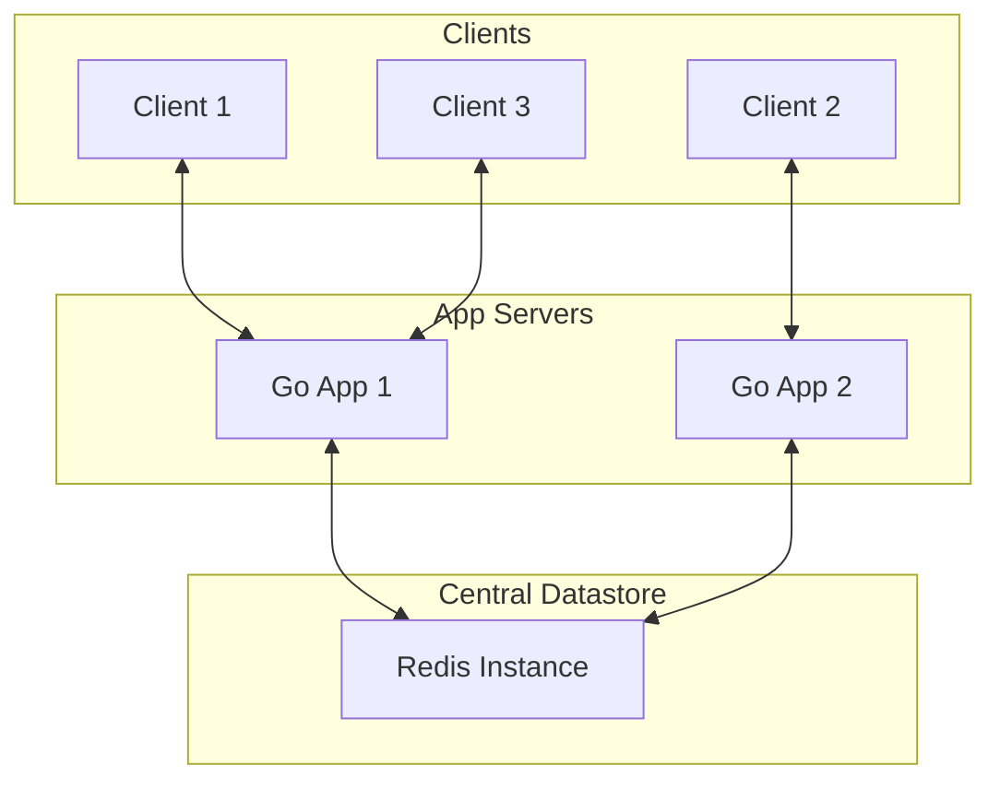

# Grain

A simple, scalable, and real-time chat application built with Go, WebSockets, and Redis.

## Architecture



## Features

- Real-time messaging with WebSockets.
- Scalable architecture using Redis Pub/Sub.
- Chat history persistence.
- Simple and easy-to-set-up.

## Getting Started

### Prerequisites

- [Go](https://golang.org/dl/)
- [Redis](https://redis.io/download)

### Installation

1.  Clone the repository:

    ```bash
    git clone https://github.com/your-username/grain.git
    ```

2.  Install dependencies:

    ```bash
    go mod tidy
    ```

3.  Run the application:

    ```bash
    go run main.go
    ```

## Usage

Connect to the WebSocket server at `ws://localhost:8080/ws?username=your-username and send json messages`.


## Contributing

Contributions are welcome! Please feel free to submit a pull request.

## License

This project is licensed under the MIT License - see the [LICENSE](LICENSE) file for details.
