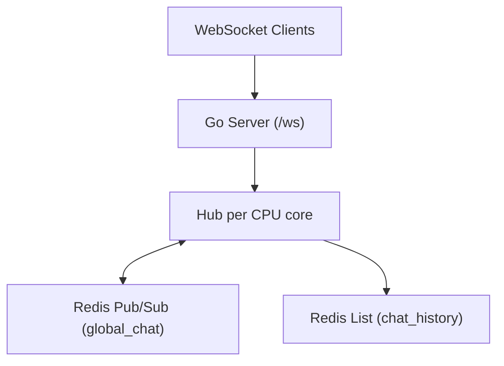

# Grain

Grain is a Go WebSocket chat backend that uses Redis Pub/Sub for fanout across hubs.

## What It Does

- Accepts WebSocket clients on `/ws`.
- Requires a `username` query parameter.
- Hashes usernames to pin each client to one in-process hub.
- Publishes inbound messages to Redis channel `global_chat`.
- Persists recent message envelopes in Redis list `chat_history` (last 100).
- Broadcasts received messages to all connected clients except the sender.

## Architecture



## Prerequisites

- Go `1.25.5+`
- Redis running on `localhost:6379`

## Run

```bash
go run ./cmd/grain
```

Optional env vars:

- `PORT` (default: `8080`)

Server startup fails fast if Redis is unreachable.

## WebSocket Contract

Endpoint:

```text
ws://localhost:8080/ws?username=<name>
```

- Client payload is treated as raw bytes and wrapped in a server envelope.

Envelope shape sent to peers:

```json
{
  "id": "client-uuid",
  "server_id": "hub-uuid",
  "username": "alice",
  "payload": {}
}
```

## Note
Non JSON payloads are invalid.

## Dependencies

- `github.com/coder/websocket`
- `github.com/redis/go-redis/v9`
- `github.com/google/uuid`

## License

MIT. See [LICENSE](LICENSE).
